# Buketträknaren: designgranskning och tre designriktningar

_Underlag för en oberoende granskning · 8 oktober 2026 · Bilderna är skärmbilder och mockuper i originalupplösning_

## 1. Din uppgift som granskare

Du är en senior produkt- och varumärkesdesigner med erfarenhet av premium- och lyxprodukter och av professionella verktyg för kreativa yrken. Uppgiften är att bedöma Buketträknarens nuvarande design och tre förslag till ny designriktning, och att tala om vilket uttryck och vilken struktur som bäst gör appen till ett exklusivt, modernt floristverktyg.

**Så här går du tillväga:**

1. **Läs avsnitt 2 och titta på bilderna i avsnitt 3** (nuläget). Skriv ned din egen första bedömning innan du läser vidare.
2. **Läs därefter avsnitt 4**, som är en annan bedömares (Claudes) synpunkter på nuläget. Pröva dem mot dina egna. De är hypoteser, inte fakta.
3. **Bedöm de tre riktningarna i avsnitt 5 till 7** och jämförelsen i avsnitt 8.
4. **Svara enligt avsnitt 9.** Hänvisa alltid till bildens kod (till exempel N3d eller B2m) så att det går att se vad du menar.

> Skilj i ditt svar mellan **vad som syns i bilderna**, **vad som är smak** och **vad som är antaganden** om hur appen fungerar. Föreslå inga kodändringar och inga nya funktioner som ändrar pris-, moms- eller förpackningslogiken. Mockuperna är statiska skisser, inte en fungerande app.

## 2. Sammanhang

### Produkten

Buketträknaren är en webbapp för professionella florister, byggd för mobilen men också använd på dator. Den räknar ut kundpriset på buketter och kundjobb och visar vad som ska köpas in hos grossisten. Språk och moms är svenska, belopp i kronor.

- **Hem:** två val (skapa en bukett, planera ett kundjobb) och senaste arbeten.
- **Jobb:** en kund med flera arrangemang (till exempel ett bröllop med brudbukett, bordsdekorationer och corsager). Varje arrangemang byggs i **bukettbyggaren** och jobbet visas i **kalkyl och inköp**.
- **Blommor:** prislistan med pris, förpackning och hur färskt priset är.
- **Snabbkalkyl:** den äldre, snabba vyn för en order med flera buketter.

### Vem använder den

Små floristföretag. Ofta på mobil i butik eller ateljé, i varierande ljus och med blöta händer, ibland på dator för planering och inköp. Ägaren är inte nöjd med den nuvarande premiumkänslan och vill ha ett uttryck med professionell, exklusiv och lyxig känsla på internationell premiumnivå, som en kommersiell produkt.

### Det som inte får ändras av designen

- Exakt penga- och förpackningsmatematik (priset räknas på hela förpackningar), momsregler och prisgrunder (inkl. och exkl. moms).
- **Prisets säkerhet visas med två tecken:** ✓ betyder bekräftat pris (aktuella priser) och ≈ betyder ungefärligt (något pris är äldre än idag).
- Tre prisnivåer hålls isär: **beräknat**, **presenterat** (avrundat) och **överenskommet**. Egna tillägg (eget lager, egen trädgård) finns med.
- Inga påhittade priser, och inga bilder eller lagersaldon som inte finns i data. Den egna prislistan har inga produktbilder.
- Sparstatus ("Sparat ✓") ska synas.

### Om bilderna

- **Testdata:** kunder, jobb, blommor och priser är påhittade men rimliga (Emma & Johan, Karin Lindgren och så vidare). Kundpriser är exempel, inte rekommendationer.
- **Nuläget (avsnitt 3):** skärmbilder av den faktiska appen i Chromium 141. Mobil är 390 px bred (skärpa 2×, filerna är 780 px), desktop 1440 px. Långa mobilsidor är delade i delar. Menyn och prisfältet hamnar längst ned i mobilbilderna eftersom fönstret gjordes lika högt som sidan.
- **Förslagen (avsnitt 5 till 8):** mockuper som är ritade i HTML och renderade i Chromium. Samma data och samma belopp som i nuläget (till exempel Brudbukett 1 615 kr: material 627,86 kr, påslag 313,93 kr, arbete 350 kr, moms 322,95 kr, avrundning 0,27 kr).
- **Blomillustrationerna i förslagen** är ritade i koden, en per blomsort, i den färg floristen valt. De är generiska och inte foton av grossistens artiklar. De är ett designförslag, inte något som finns i appen idag.
- **Nuvarande identitet:** ivory #F6F3EC, deep olive #263A30, dusty rose #B78F91, sage #DCE3D8, stone #C5B59D. Cormorant Garamond för rubriker och Figtree för funktionell text.

## 3. Nuläget: 19 bilder

Sju vyer på mobil (390 px) och desktop (1440 px). Bildtexterna beskriver bara vad som visas.

### N1 och N2. Hem

**N1m Hem, första besöket (mobil)**

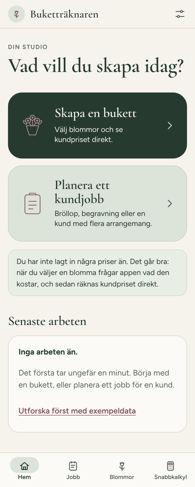

**N1d Hem, första besöket (desktop)**

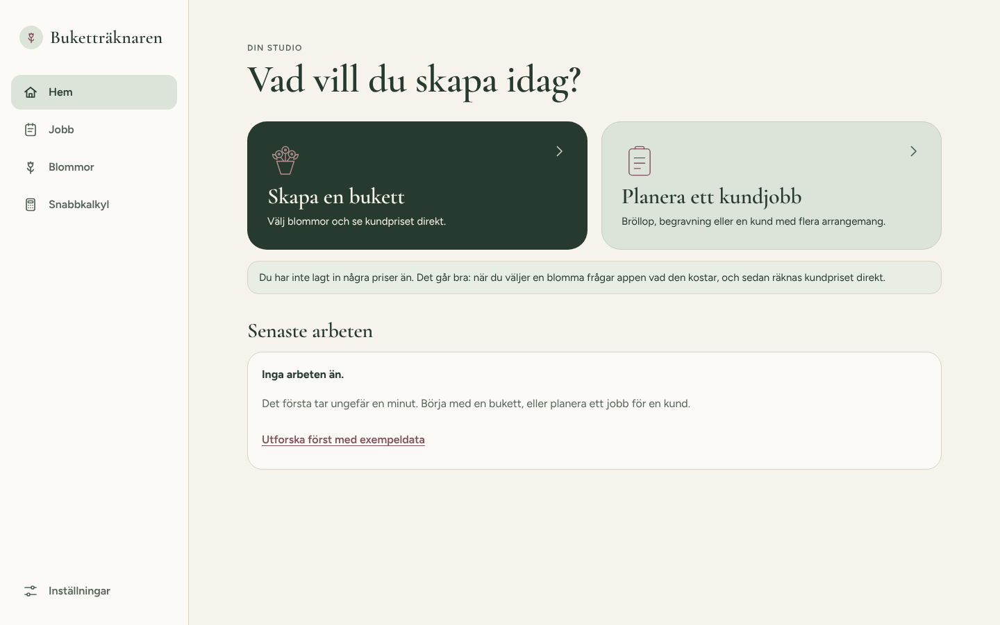

_Tom prislista och inga jobb. Två stora val och en förklaring._

**N2m Hem med sparade arbeten (mobil)**

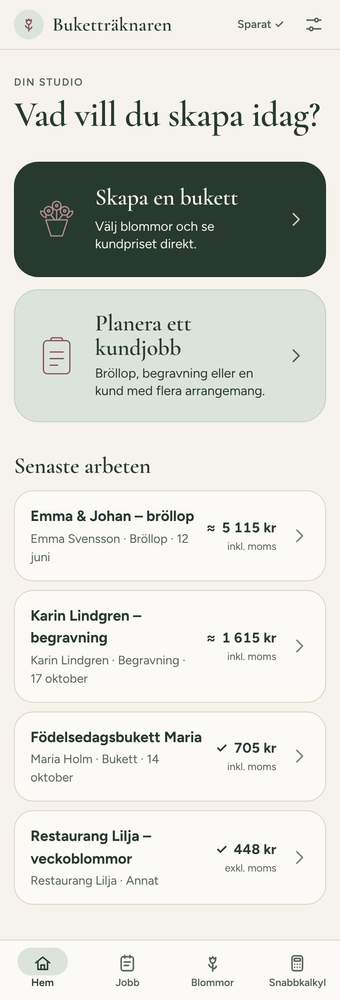

**N2d Hem med sparade arbeten (desktop)**

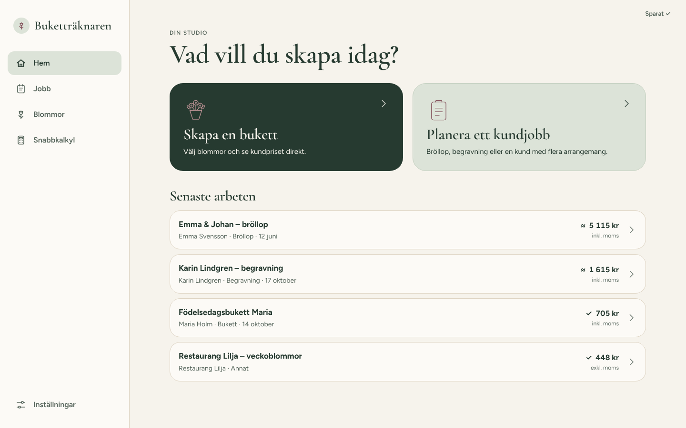

_Fyra jobb med kundpris. ≈ 5 115 kr och ≈ 1 615 kr är ungefärliga, ✓ 705 kr och ✓ 448 kr bekräftade (448 kr är exkl. moms)._

### N3. Bukettbyggaren (Brudbukett)

**N3m1 mobil, del 1**

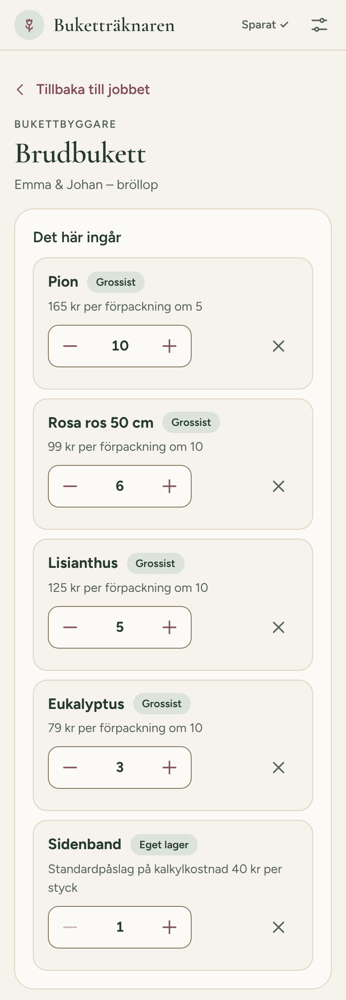

**N3m2 mobil, del 2**

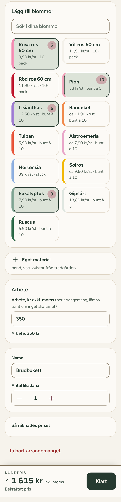

**N3d desktop**

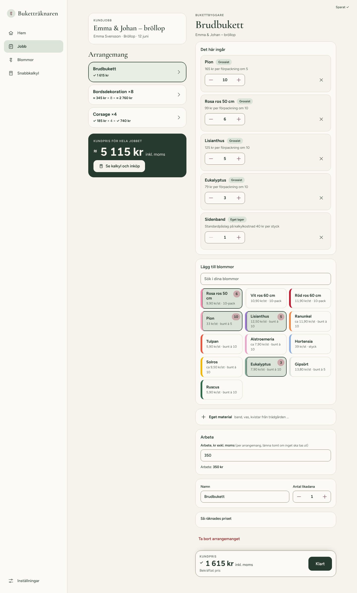

_Rader med blomma, källa (Grossist eller Eget lager), förpackningspris och antal. Därunder blommor att lägga till, eget material, arbete, namn, antal och kundpris._

### N4. Jobb (Emma & Johan, bröllop)

**N4m Jobb (mobil)**

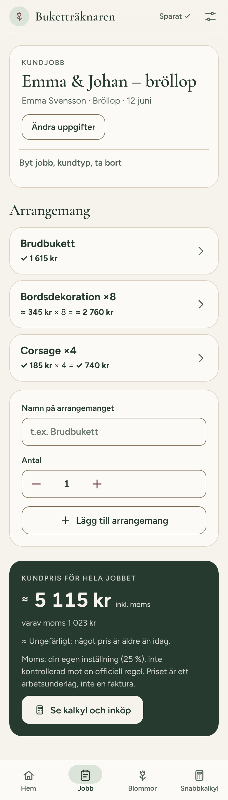

**N4d Jobb (desktop)**

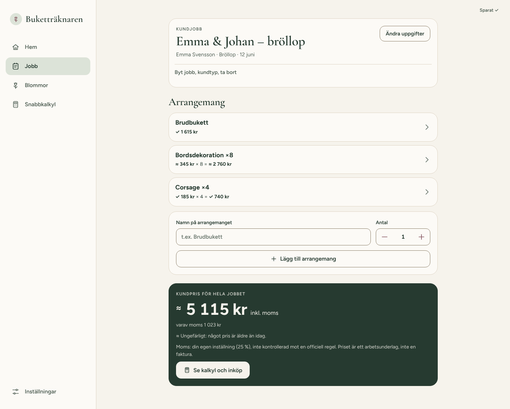

_Tre arrangemang (Brudbukett, Bordsdekoration ×8, Corsage ×4) och kundpris för hela jobbet._

### N5. Kalkyl och inköp

**N5m1 mobil, del 1**

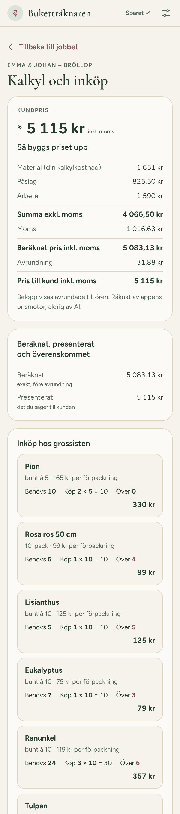

**N5m2 mobil, del 2**

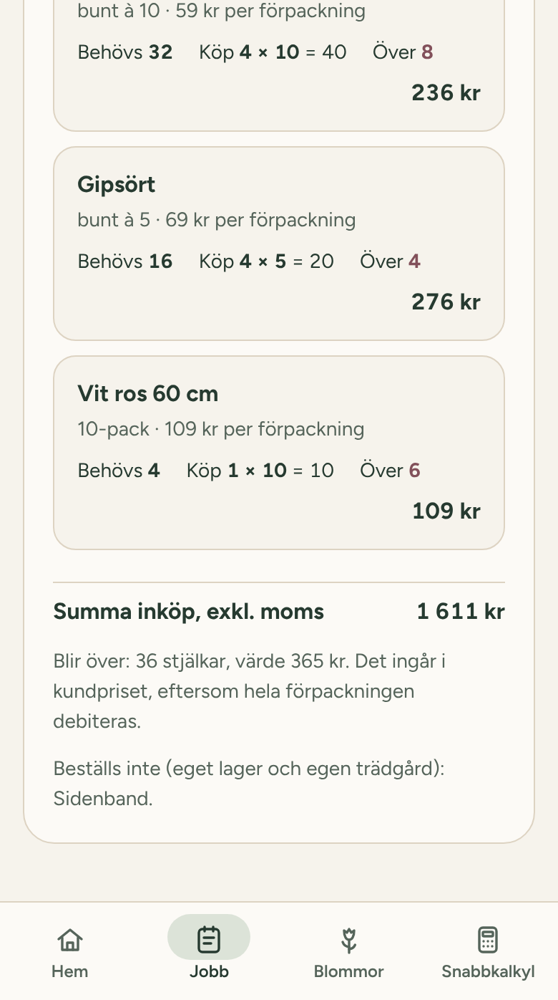

**N5d desktop**

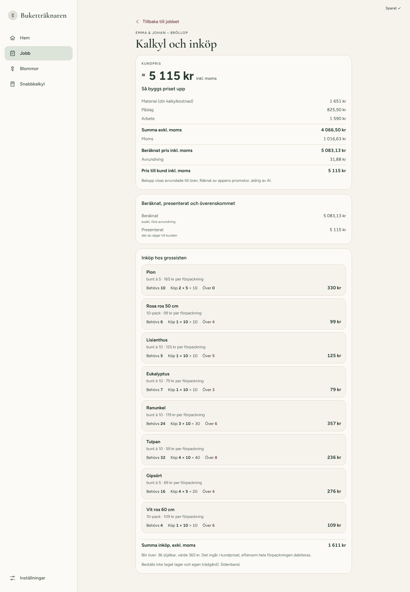

_Hur kundpriset byggs upp (material, påslag, arbete, moms, avrundning), beräknat mot presenterat pris, och inköp per blomma (behövs, köp, över)._

### N6. Blomkatalogen

**N6m1 mobil, del 1**

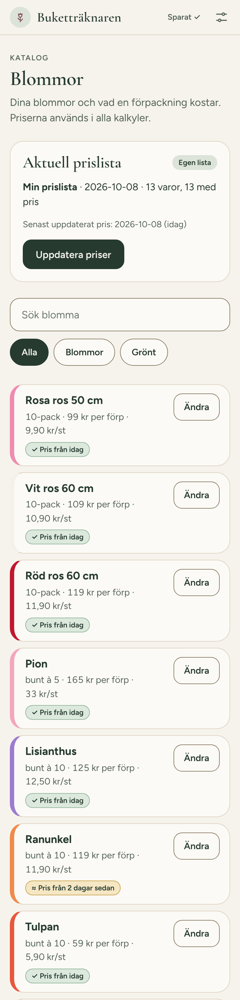

**N6m2 mobil, del 2**

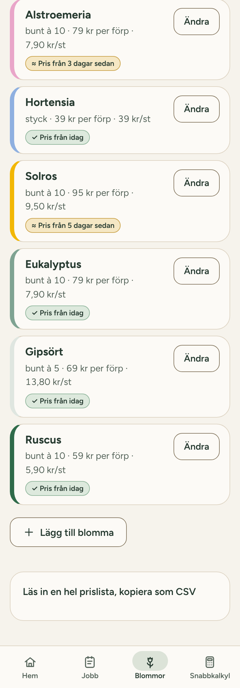

**N6d desktop**

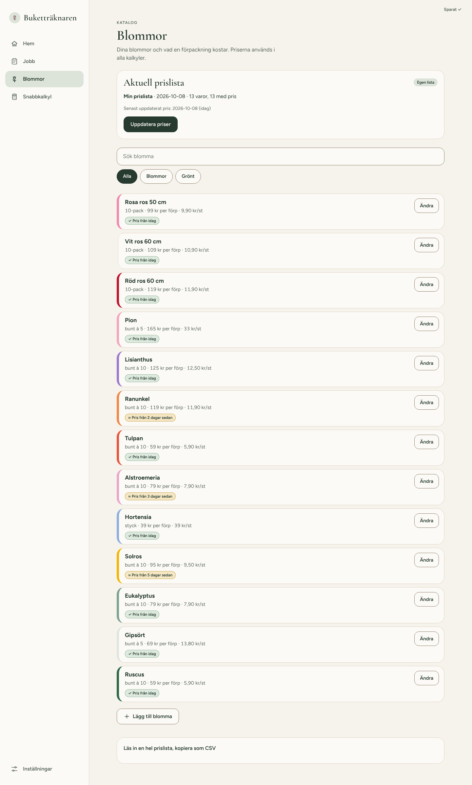

_Tretton blommor med pris, förpackning och färskhet ("Pris från idag" eller "Pris från N dagar sedan")._

### N7. Snabbkalkylen

**N7m1 mobil, del 1**

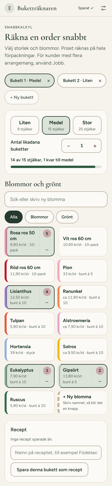

**N7m2 mobil, del 2**

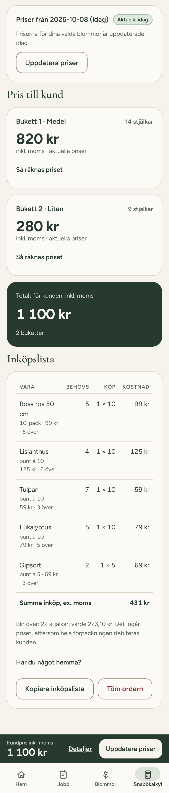

**N7d1 desktop, första vyn (1440×900)**

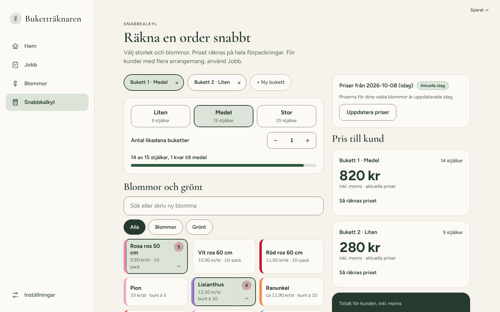

**N7d2 desktop, hela sidan (högerkolumnen utfälld för fotot)**

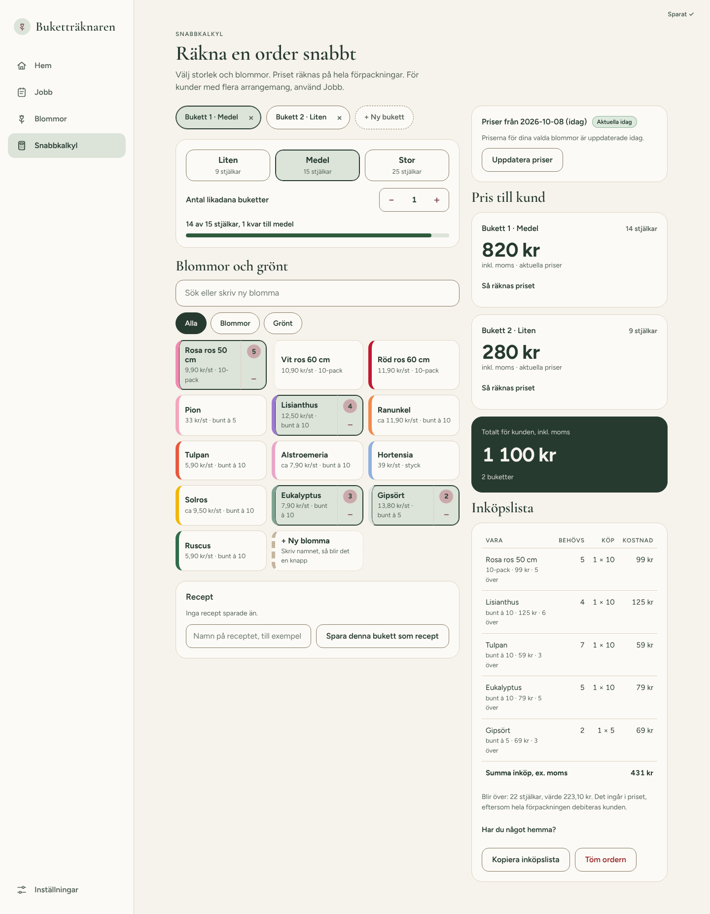

_Två buketter, totalt kundpris och inköpslista. På en riktig desktop är högerkolumnen klistrad och rullar för sig._

> **Stanna här. Skriv ned din egen bedömning av nuläget (premiumkänsla, typografi, färg, proportioner, hur intuitivt det är) innan du läser avsnitt 4.**

## 4. En annan bedömares synpunkter på nuläget (Claude)

Det här är hypoteser att pröva mot bilderna, inte facit. Det som fungerar: en huvudhandling per skärm, kundpriset i fokus, ≈ och ✓ för prisets säkerhet, och en lugn återhållsamhet. Appen känns ändå som ett välgjort administrationssystem snarare än ett exklusivt floristverktyg. Skälen:

1. **Inga blommor.** Det enda som antyder blommor är en tunn färgkant på blombrickorna (N3, N6, N7). Ett verktyg för floristik utan en enda blomma ser ut som ett kalkylark.
2. **Allt har samma vikt.** Nästan allt är ett rundat kort med ljus ram på ivory. Utöver kundpriset finns ingen rytm, inget fokalobjekt och inga vilopunkter. Det ger ett SaaS-intryck, inte ett ateljéintryck.
3. **Färgen är för tyst.** Olive, sage och dusty rose på ivory blir spa-aktigt. Rosen syns bara i små ikoner och länkar, och sage täcker flera ytor utan att något sticker ut (N1, N2).
4. **Typografin håller inte ihop.** Serifen i rubrikerna är fin, men resten är en vänlig sans i små grå storlekar. Priserna, det florister läser mest, sätts i samma neutrala sans och saknar en egen röst.
5. **Proportionerna.** På desktop är innehållet en utsträckt mobilkolumn med stora tomma sidor (N4d). I bukettbyggaren är vänsterkolumnen kort och högerkolumnen lång (N3d). På mobilen är byggaren cirka 2 750 px hög (mätt i CSS-pixlar vid 390 px bredd; bilderna N3m1 och N3m2 är 5 490 px höga eftersom de är tagna med dubbel skärpa) med många likadana steppers.
6. **Formulärspråk.** "Det här ingår" som rader med chips, fält för Arbete, Namn och Antal, en röd "Ta bort"-länk och "Läs in en hel prislista, kopiera som CSV" (N6) är administrationsspråk.
7. **Strukturellt.** Buketten finns inte som objekt (man ser en lista, inte en bukett). Flödet kräver scroll mellan val och pris. Hem och Snabbkalkyl överlappar. Desktop är inte en arbetsyta.
8. **Namnet.** "Buketträknaren" låter som en kalkylator. Det är ett varumärkesbeslut som inte ingår i uppgiften.

## 5. Riktning A: Maison (redaktionell lyx)

**Idé.** Appen som en trycksak från ett modehus. Papper, varm svart, brons och hårfina linjer. Buketten ritas som en botanisk gravyr och ingredienserna står som en "Komposition" (som en parfymörs formelkort).

| Egenskap | Beskrivning |
| --- | --- |
| Färger | Papper #F3EEE4, ytor #FAF7F0, bläck #1D1A15, dämpad text #6B6254, linjer #D3C9B8, brons #7C5A2D (accent), claret #7A2E3E (ordaccent). Blomfärgerna finns bara i illustrationerna. |
| Typografi | Bodoni Moda (display, kursiv för accentord) och Jost (funktionell text). Små etiketter i spärrade versaler. Priser i Bodoni. |
| Form | Kantiga former, hårfina linjer, inga skuggor. Dubbla ramar som en gravyrplansch. Knappar är rektangulära. |
| Strukturidé | Läsflöde uppifrån och ned som ett recept: bukettplansch, pris, kvitto och därefter komposition, tillägg och arbete. |
| Mobil | En kolumn, klistrad prisrad längst ned. Kvittot ("Så räknades priset") ligger öppet. |
| Desktop | Textmeny i toppen. Vänster: plansch och pris. Höger: komposition och blommor. Hem är en redaktionell uppslagssida. |
| Bilder | A1m, A1d (Hem). A2m1, A2m2, A2d (bukettbyggare). |

**A1m Hem (mobil)**

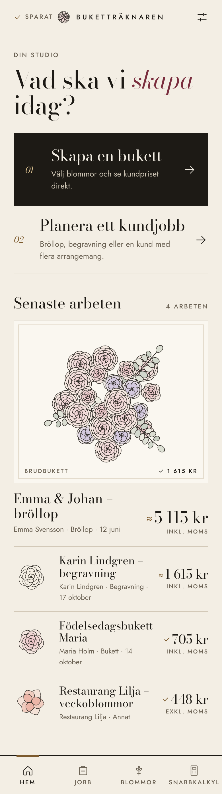

**A1d Hem (desktop)**

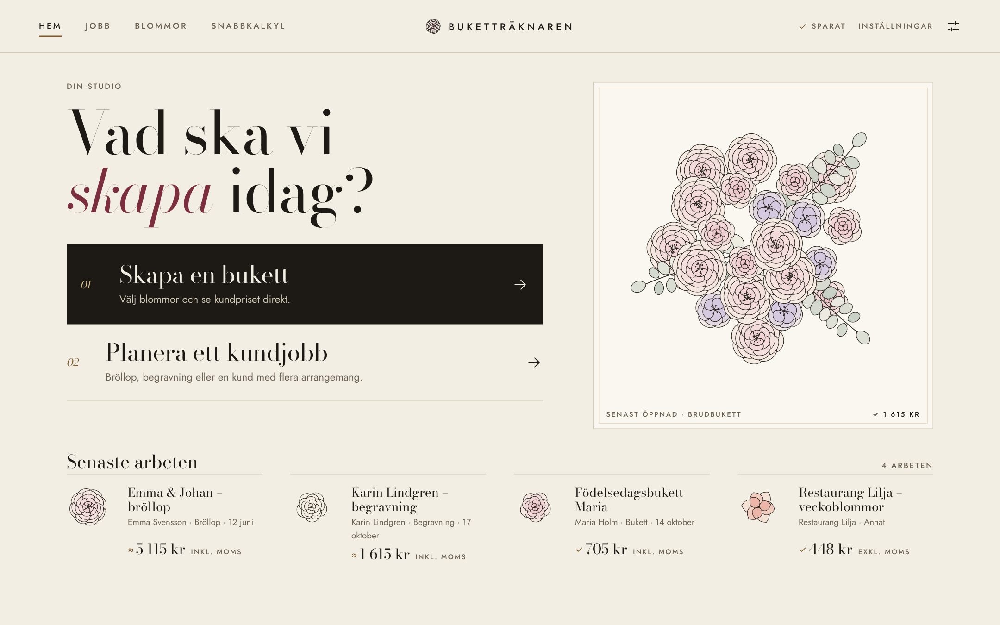

**A2m1 bukettbyggare, mobil del 1**

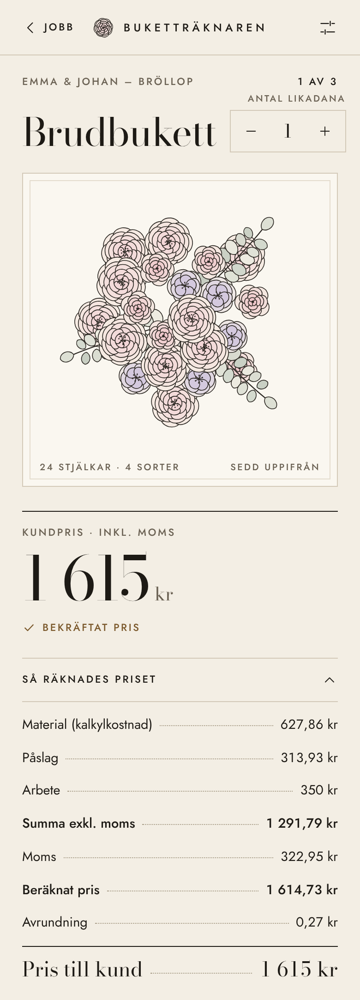

**A2m2 bukettbyggare, mobil del 2**

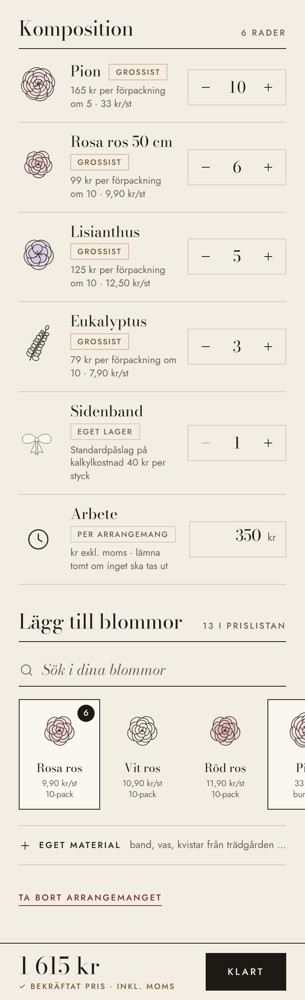

**A2d bukettbyggare (desktop)**

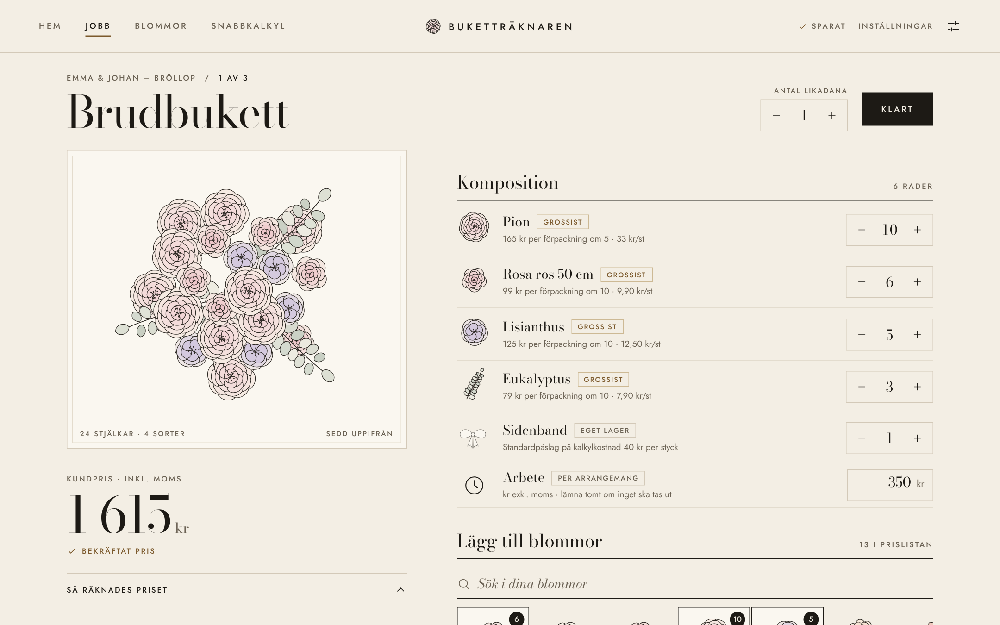

**Styrkor (claims att pröva).** Mest tidlöst och mest "dyrt" i tonen. Hög typografisk kvalitet. Mycket luft. Tydlig hierarki. Den ljusa miljön passar en butiksmiljö.

**Risker (claims att pröva).** Bodonis hårfina streck och små siffror kan bli svårlästa i små storlekar och i dåligt ljus. Raderna i listan ser mindre ut som knappar och kan upplevas som mindre handgripliga än i en app. Färgenergin är låg, så uttrycket kan bli kallt eller skört. Lång sida på mobil.

## 6. Riktning B: Nocturne (mörk scen)

**Idé.** Buketten är scenen. Nattgrönt med champagneguld, lysande blommor och ett prisfält som flyter över scenen. Appen som ett dramatiskt, nästan scenografiskt verktyg för eventfloristik.

| Egenskap | Beskrivning |
| --- | --- |
| Färger | Natt #0A1310, ytor #12201A och #182A22, bläck #F3EDE0, dämpad text #A9B4A9, guld #DCC291 (enda accent), blomfärger som ljus mot mörkret. |
| Typografi | Instrument Serif (display, kursiv guld för accentord) och Manrope (funktionell text och siffror). |
| Form | Rundade ytor, pillformer, flytande glas med suddig bakgrund, mjuka glöd och skuggor. |
| Strukturidé | Scen först: bukettillustrationen i mitten, priset alltid synligt, ingredienserna i en panel. Mobil använder en bottenpanel med tre flikar (Ingår, Lägg till, Pris och arbete). |
| Mobil | Tre lägen av samma skärm (B2m): ingredienser, lägg till blommor, pris och arbete med kvitto. |
| Desktop | Tre paneler: jobb och arrangemang till vänster, scen i mitten, ingredienser och blommor till höger. Ikonlist till vänster. |
| Bilder | B1m, B1d (Hem). B2m (tre lägen), B2d (bukettbyggare). |

**B1m Hem (mobil)**

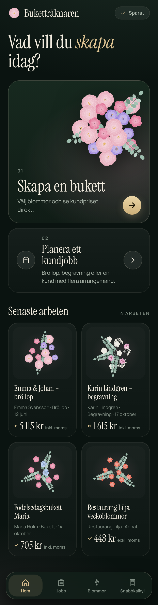

**B1d Hem (desktop)**

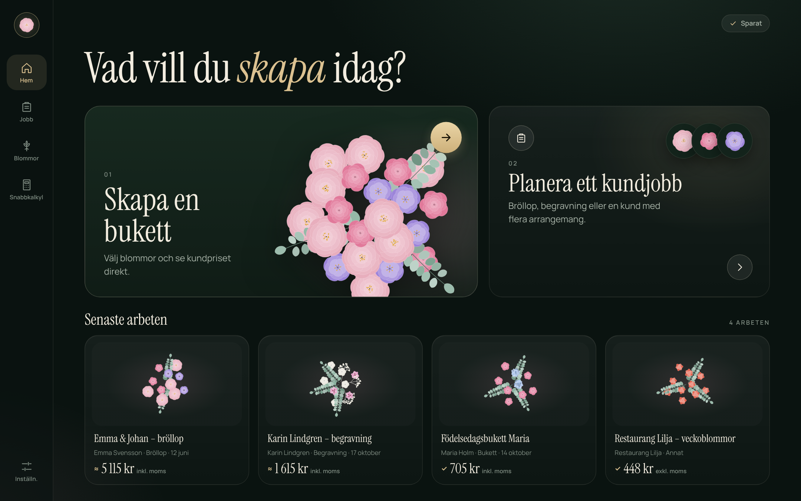

**B2m bukettbyggare, mobil i tre lägen**

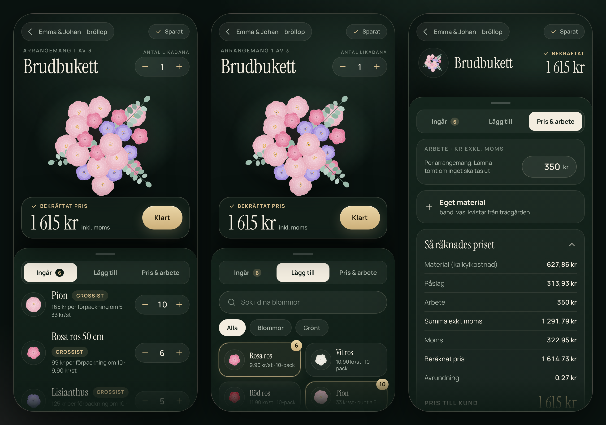

**B2d bukettbyggare (desktop)**

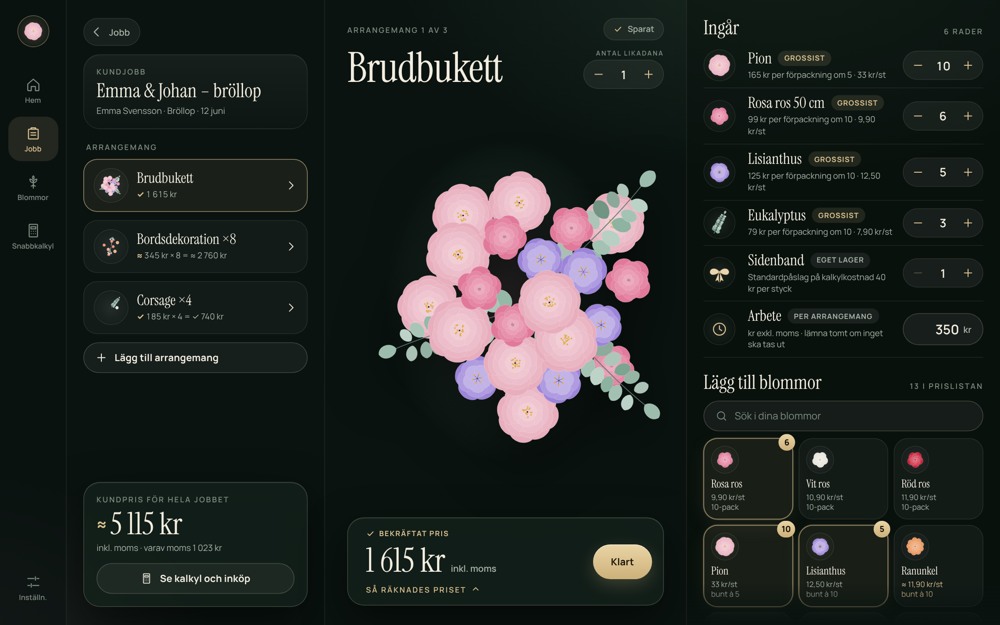

**Styrkor (claims att pröva).** Starkast första intryck och tydligast "kreativt verktyg". Blommorna lyser. Mindre scroll i byggaren eftersom bottenpanelen byter läge (844 px per läge). Desktop får en riktig arbetsyta.

**Risker (claims att pröva).** Ett mörkt gränssnitt kan vara svårare att läsa i starkt butiksljus eller utomhus. Guld på mörkt kan dra åt fintech eller nattklubb om det överdrivs. Bottenpanelen med flikar kräver mer interaktionsdesign och test. Tyngre att rendera (suddighet, glöd). Det behövs en ljus variant. De generiska blomillustrationerna måste vara riktigt bra, annars försvinner effekten.

## 7. Riktning C: Palett (ljus, färgstark produktkänsla)

**Idé.** Blommornas färger är gränssnittets färger. Blombrickor som färgprover, ett färgband som visar buketten i proportion, och aubergine som bläck. Känns som en modern kommersiell produkt för yrkesfolk.

| Egenskap | Beskrivning |
| --- | --- |
| Färger | Varm vit #FAF6F0, bläck #241A26 (aubergine), pastellytor per blomma (blush #FBDDE4, lavendel #E6DDF7, aprikos #FCDFC8, salvia #DCEADF, smör #FBF0C2, himmel #DCE9F8), bekräftat #1C7550, ungefärligt #9A5A06. |
| Typografi | Bricolage Grotesque genomgående (tät, tydlig, med karaktär). Priser fetstilta. |
| Form | Rundade kort med mjuk skugga, stora tryckytor, färgade brickor. |
| Strukturidé | Paletten är bygget: välj blommor direkt på brickorna (steppers i brickan), se sammansättningen i ett färgband, priset alltid synligt. |
| Mobil | En kolumn: titel med pris, färgband, "I buketten", resten av blommorna i kompakt tre-kolumnsrutnät, sedan arbete och kvitto. Flytande bottenfält med pris och Klart. |
| Desktop | Sidofält, palettyta i mitten och en inspektör till höger (bukettillustration, pris, ingredienser, arbete, kvitto). På Hem finns en ruta för prislistans färskhet. |
| Bilder | C1m, C1d (Hem). C2m1, C2m2, C2d (bukettbyggare). |

**C1m Hem (mobil)**

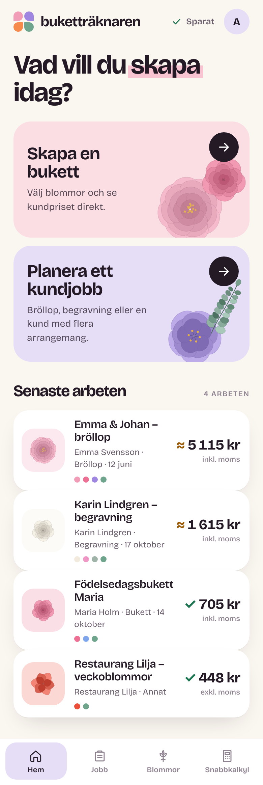

**C1d Hem (desktop)**

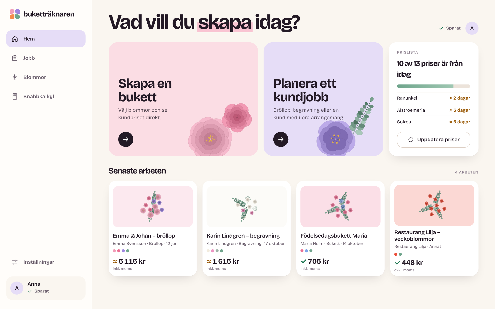

**C2m1 bukettbyggare, mobil del 1**

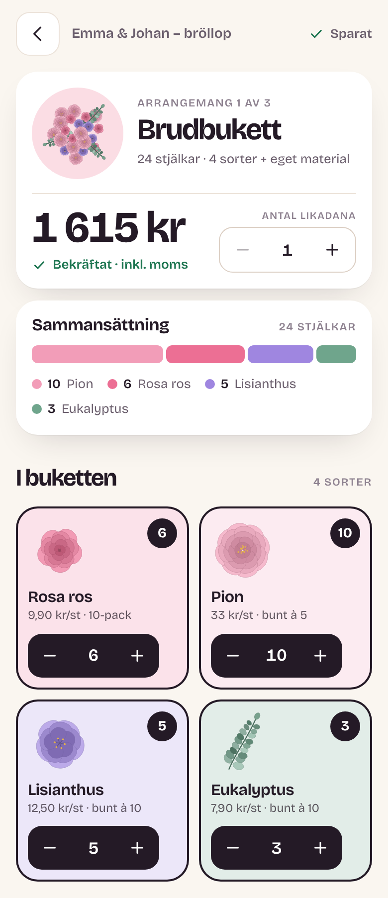

**C2m2 bukettbyggare, mobil del 2**

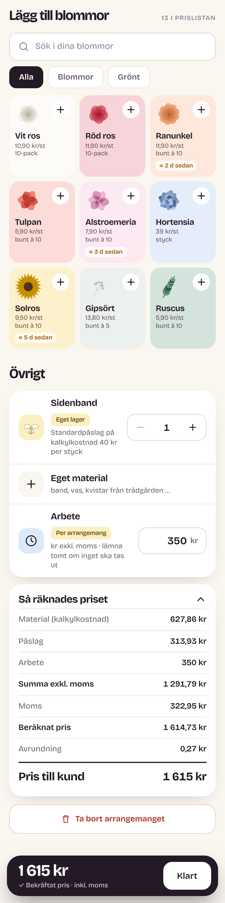

**C2d bukettbyggare (desktop)**

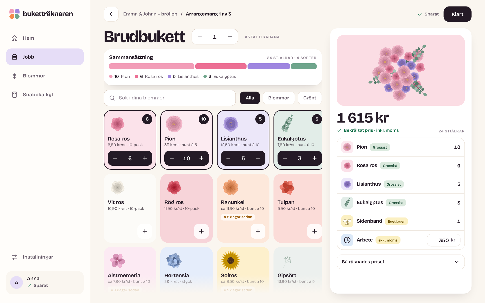

**Styrkor (claims att pröva).** Snabbast att läsa och använda. Färgerna kommer från blommorna. Val och antal görs på samma bricka, så man behöver inte hoppa mellan en lista och ett urval. Färgbandet ger en snabb överblick över sammansättningen. Mest "produkt".

**Sidlängd på mobil (mätt).** Bukettbyggaren är cirka 2 460 px hög i C och cirka 2 360 px i A, mot cirka 2 750 px i nuläget. A och C är alltså bara ungefär 10 till 15 procent kortare. Skillnaden ligger i ordningen och i att priset alltid syns, inte i mindre scroll. Bara B minskar scrollandet i sak (tre lägen i en bottenpanel, 844 px per läge, med scroll inne i panelen).

**Risker (claims att pröva).** Minst "lyx" av de tre och kan upplevas som ett vänligt startup-verktyg. Många pastellfärger kan bli barnsliga om de inte hålls i schack. Bricolages karaktär passar inte alla premiumbilder. Kontrast mellan text och pastellbrickor måste mätas. Verkliga blomfärger kan krocka med de pastella ytorna.

## 8. Jämförelse

De tre riktningarna på mobil, första skärmen. A till vänster, B i mitten, C till höger.

**J1 Hem, mobil, första skärmen**

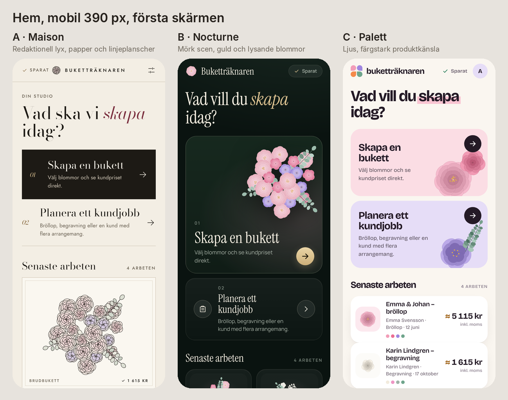

**J2 Bukettbyggare, mobil, första skärmen**

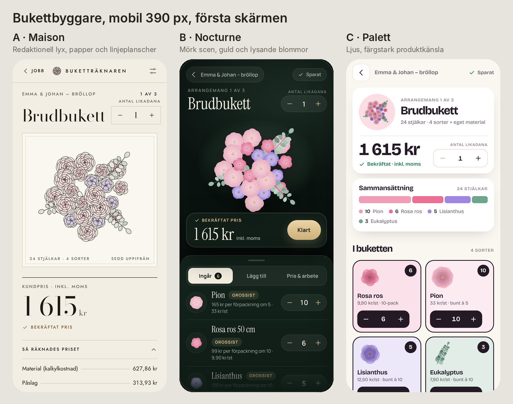

| Aspekt | A Maison | B Nocturne | C Palett |
| --- | --- | --- | --- |
| Intryck | Tidlös, redaktionell | Dramatisk, scenografisk | Modern, färgstark, tydlig |
| Ljusläge | Ljust (papper) | Mörkt (natt) | Ljust (varm vit) |
| Byggmetafor | Receptkort och plansch | Scen med flytande pris | Färgpalett och inspektör |
| Mobilmönster | Lång kolumn, klistrad pris | Bottenpanel med flikar | Kolumn med bricköversikt |
| Desktopmönster | Redaktionellt tvåkolumnsuppslag | Tre paneler | Palett och inspektör |
| Beroende | Kvalitativa linjeillustrationer | Kvalitativa lysande illustrationer | Illustrationer i platta färger |
| Största risk | Läsbarhet, kyla | Läsbarhet i ljus, tyngd | Mindre lyx, barnslighet |

## 9. Frågor och önskat svarsformat

1. **Premium:** Vilken riktning känns mest internationellt premium och professionellt trovärdig, och varför (konkreta visuella skäl)? Vilka enskilda detaljer drar ned intrycket i respektive riktning?
2. **Typografi, färg, proportioner och kontrast:** bedöm varje riktning. Peka på det som är starkast och svagast.
3. **Administrationssystem eller kreativt verktyg:** vilken riktning flyttar appen bort från administrationskänslan mest, och vad kvarstår av den?
4. **Intuition:** hur snabbt förstår en florist första skärmen och bygg-flödet i varje riktning? Var kan hen fastna?
5. **Mobil och desktop:** hur väl utnyttjar varje riktning respektive skärmstorlek?
6. **Struktur:** vilka förändringar måste göras på strukturell nivå (inte bara kosmetiskt) oavsett vilken riktning som väljs?
7. **Balans:** hur väl balanseras kreativitet, blommor, ekonomi och administration?
8. **Risker:** läsbarhet i butiksljus, tillgänglighet och kontrast, prestanda, underhåll och behov av bildmaterial.
9. **Rekommendation:** vilken riktning (eller kombination) rekommenderar du, och vilka tre ändringar är viktigast att göra först?
10. **Underlaget:** vad saknas för att du ska kunna bedöma säkert?

**Svara i den här ordningen:**

- **Kort sammanfattning** (högst tio rader).
- **Tabell med betyg 1 till 5** per kriterium och riktning, med en mening som motivering. Kriterier: premiumkänsla, typografi, färg, proportioner, intuition, mobil, desktop, balans kreativitet och ekonomi.
- **Rangordning** av A, B och C med motivering.
- **Konkreta justeringar** per riktning (högst fem punkter vardera).
- **Gör och gör inte** för den slutliga designen.
- **Öppna frågor** att ställa till en florist.
- Markera varje påstående som **observation i bild**, **smak** eller **antagande**.

## 10. Begränsningar och öppna frågor

- Mockuperna är statiska HTML-skisser, inte en implementation. Interaktion, laddningstider och verkliga data är inte testade.
- Blomillustrationerna är generiska per blomsort. Appen har inga produktfoton och det är inte antaget att grossisten skickar några.
- Allt är testat i Chromium 141 (headless). Det är inte testat på riktiga telefoner, i Safari eller i Firefox. Typsnitten hämtades från Google Fonts.
- Kontrast och tillgänglighet är inte mätta för mockuperna, bara bedömda på ögonmått. (Nuläget är mätt med axe-core och WCAG-test, men det ingår inte i det här underlaget.)
- Ingen florist har provat något av detta. Alla bedömningar om "intuitivt" är antaganden.
- De övriga skärmarna (Jobb, Kalkyl och inköp, Blomkatalog, Snabbkalkyl) är inte ritade i de nya riktningarna.
- Ingen kod är ändrad. Ingen implementation sker innan ägaren har valt riktning.

## Bilaga: filöversikt

Filerna ligger i mapparna images/nulage (19 bilder) och images/forslag (16 bilder). Namnet börjar med bildens kod. Alla bilder är i originalupplösning och orörda.

- **Nuläget:** N1m, N1d, N2m, N2d, N3m1, N3m2, N3d, N4m, N4d, N5m1, N5m2, N5d, N6m1, N6m2, N6d, N7m1, N7m2, N7d1, N7d2.
- **Förslag:** A1m, A1d, A2m1, A2m2, A2d, B1m, B1d, B2m, B2d, C1m, C1d, C2m1, C2m2, C2d, J1, J2.
- **Suffix:** m betyder mobil (390 px), d betyder desktop (1440 px), siffran efter m är delen i en delad mobilbild.
